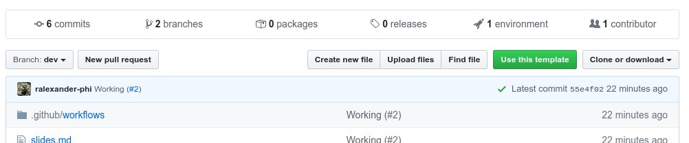
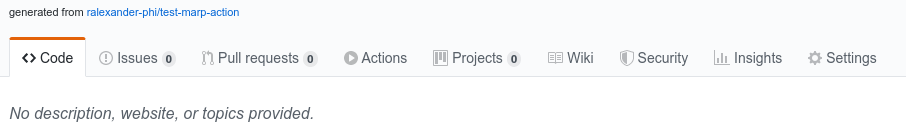

<!--
theme: gaia
class:
 - invert
headingDivider: 2 
paginate: true
-->

<!--
_class:
 - lead
 - invert
-->

# Deploy Marp to GitHub Pages

Presentations to Webpages: Instantly!

## What?

[Marp](https://marp.app/) lets you create HTML slides from markdown (like this!).

This presentation is both a [website](https://alexsci.com/marp-to-pages) and a [README.md](https://github.com/ralexander-phi/marp-to-pages/blob/main/README.md).

## Why?

Treat your presentation the same way you treat code.

- Use git to track changes
- Pull requests to collaborate
- Deploy automatically
- See a problem? Open an issue!

## Setup

Want to create your own?

First, create a new repo [from the template repo](https://github.com/ralexander-phi/marp-to-pages).



## Configure GitHub Pages

Open your new repo and [setup publishing](https://help.github.com/en/github/working-with-github-pages/configuring-a-publishing-source-for-your-github-pages-site#choosing-a-publishing-source).

You'll typically use `gh-pages` as the deploy branch.

## Review Build

Click on Actions tab and see if the build succeeded (it may take some time).



You should now see the generated files in the `gh-pages` branch.

## View webpage

Open your deployed webpage to see the content.

Out of the box you should see `README.md` as `/index.html` and `/README.pdf`. Slides under `docs/` are also converted.

## Running locally

Locally you'll run commands like:

```
$ marp README.md -o build/README.pdf
```

or

```
$ npx @marp-team/marp-cli@latest README.md -o build/README.pdf
```

## As a workflow step

The workflow runs an equivalent step:

```
- name: Marp Build (README.pdf)
  uses: docker://marpteam/marp-cli:v1.7.0
  with:
    args: README.md -o build/README.pdf
  env:
    MARP_USER: root:root
```

Note the `args` match the previous slide.

## Customizing the build

Anything in the `build/` folder will be deployed to GitHub Pages.

You can copy extra files or run further processing steps using other tools.

## Learn more about Marp

This is a good time to learn more about Marp. Here's some resources:

- [CommonMark](https://commonmark.org/)
- [Cheat Sheet](https://commonmark.org/help/)
- [Themes](https://github.com/marp-team/marp-core/tree/master/themes)
- [CSS Themes](https://marpit.marp.app/theme-css)
- [Directives](https://marpit.marp.app/directives)
- [VS Code plugin](https://marketplace.visualstudio.com/items?itemName=marp-team.marp-vscode)

## Example Sites

Known sites using this action are:

- [University of Illinois at Urbana-Champaign's CS 199 Even More Practice](https://cs199emp.netlify.app/) [(code)](https://github.com/harsh183/emp-125)
- [Exploring agent based models](https://roiarthurb.github.io/Talk-UMMISCO_06-07-2020/) [(code)](https://github.com/RoiArthurB/Talk-UMMISCO_06-07-2020)

Send a [pull request](https://github.com/ralexander-phi/marp-to-pages) to get your site added.

## Publish your slides

When you are ready to share your presentation, commit or merge to `main` and your content on GitHub Pages will automatically update.

# 🎉
<!--
_class:
 - lead
 - invert
-->
### Hooray!


