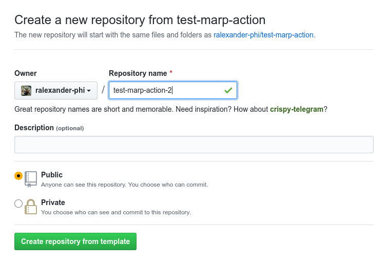
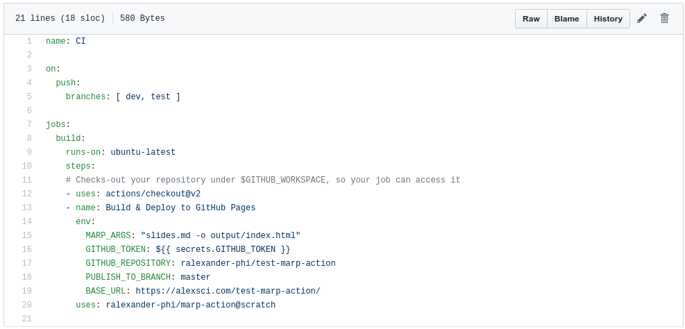

# Marp Action for GitHub

Create a [GitHub Pages](https://pages.github.com/) website presentation from a markdown file using [Marp](https://marp.app/)!

This presentation is both a [website](https://alexsci.com/test-marp-action) and a [README.md](https://github.com/ralexander-phi/test-marp-action/blob/dev/README.md).

---

## How this works

Marp is a tool that converts markdown files to presentation files, like PowerPoint PPTX files or HTML presentations.

This GitHub Action lets you build a workflow that generates an HTML presentation and publishes it to GitHub Pages.

Edit your presentation as a markdown file, track changes with git, GitHub pull requests, etc.

---

## Demo

This website is deployed from a [sample repo](https://github.com/ralexander-phi/test-marp-action) and hosted on GitHub Pages.

---

## Setup

First, create a new repo [from the template repo](https://github.com/ralexander-phi/test-marp-action).

---

---

## Configure GitHub Pages

[Setup publishing](https://help.github.com/en/github/working-with-github-pages/configuring-a-publishing-source-for-your-github-pages-site#choosing-a-publishing-source).
You'll need to remember the branch and URL.

---

## Update Workflow

You'll update the workflow file over the next slides. You can do this right in the GitHub web page (click on the pencil icon).

---

## MARP\_ARGS

The default should be fine.

[Learn more about the Marp command line arguements.](https://github.com/marp-team/marp-cli/blob/master/README.md#basic-usage)

---

## PUBLISH\_TO\_BRANCH

You'll edit the markdown files on the `dev` branch.

The build will publish to the branch you selected ealier for GitHub Pages to use.

Likely `master` or `gh-pages`.

Set that branch here.

---

## BASE\_URL

Update this to whatever domain GitHub pages will be using.

If you add a custom domain later, you'll want to update this.

---

## Update Workflow

Finish the changes and commit back to the dev branch.

This will kick off a build.

---

## Check if the build succeeded

Click on Actions tab and see if the build succeeds.

---

## Load your new web page

It may take a few minutes for GitHub to publish the site and any updates, so be patient.

---

## Create your slides

Edit README.md with your content.

You can [install and run marp-cli](https://github.com/marp-team/marp-cli/blob/master/README.md) locally to test out the content before publishing.

---

# 🎉

Hope you like it!

